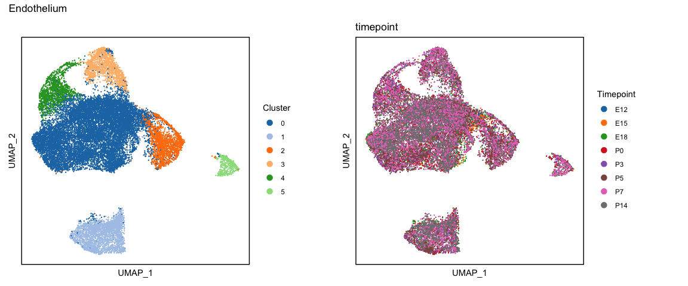
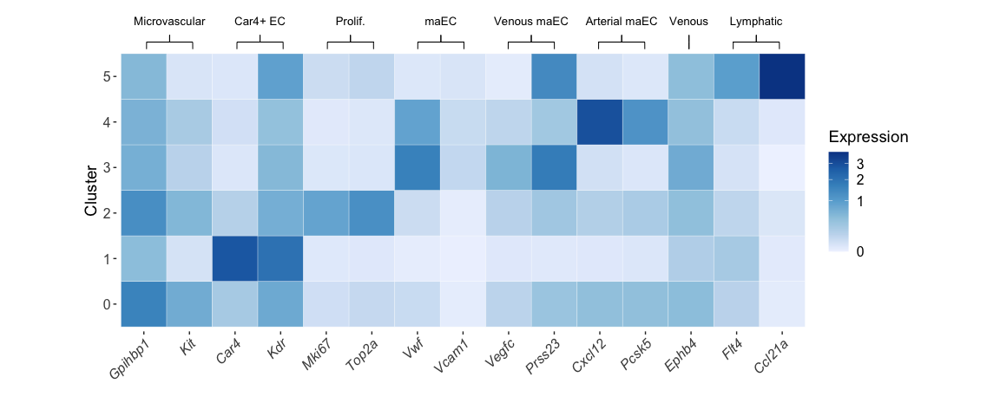
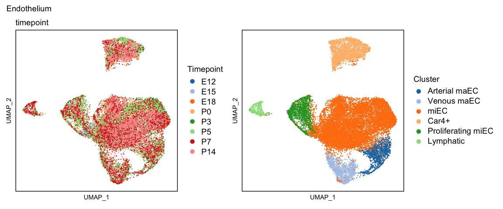
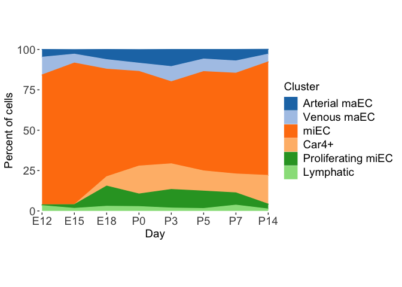
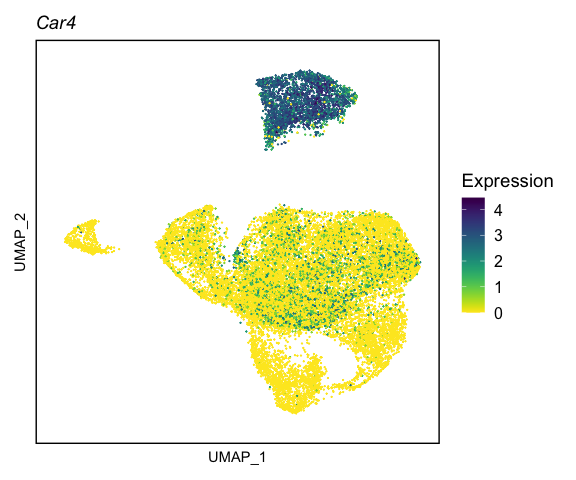
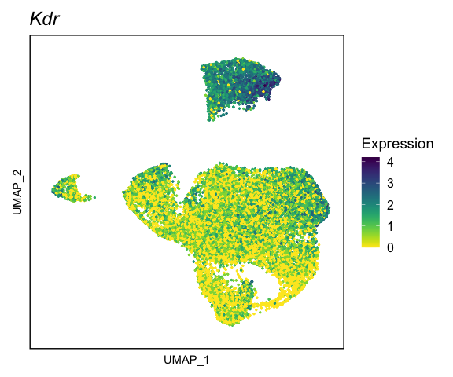

scSEQ analysis of the developing endothelium
================
Nick Negretti
11/17/20

# Analysis of the lung endothelium

## Load libraries and helper functions

``` r
setwd("~/postdoc/code/devo_scseq_github")
source("./helper_functions/globals.R")
source("./helper_functions/libraries.R")

opts_knit$set(root.dir = getwd())

source("./helper_functions/trajectory.R")
source("./helper_functions/cluster.R")
source("./helper_functions/colors.R")
source("./helper_functions/brackets.R")
source("./helper_functions/heatmaps.R")

plan("multiprocess", workers = N_WORKERS)
```

## Load data from merge and clean pipeline

``` r
endo <- readRDS("./data/endo_full_noGm42418_sct_p7b_integrated_retransform.rds")
```

## UMAP and clustering

``` r
plan("sequential")

# Make the tiempoints an ordered factor, so they are displayed consistantly
endo$timepoint <- ordered(as.factor(endo$timepoint), unique(endo$timepoint))

endo <- cluster_pca_umap(endo, k_param = 20, dims_umap = 1:20, dims_neighbors = 1:20, cluster_res = 0.1) # Note, this breaks if future is set to plan: multiprocess
```

    ## Warning: The default method for RunUMAP has changed from calling Python UMAP via reticulate to the R-native UWOT using the cosine metric
    ## To use Python UMAP via reticulate, set umap.method to 'umap-learn' and metric to 'correlation'
    ## This message will be shown once per session

    ## Computing nearest neighbor graph

    ## Computing SNN

    ## Modularity Optimizer version 1.3.0 by Ludo Waltman and Nees Jan van Eck
    ## 
    ## Number of nodes: 22267
    ## Number of edges: 726950
    ## 
    ## Running Louvain algorithm...
    ## Maximum modularity in 10 random starts: 0.9419
    ## Number of communities: 6
    ## Elapsed time: 5 seconds

``` r
p_cluster <- DimPlot(endo) + umap_theme() +
        scale_colour_manual(name = "Cluster", values = color_category_20) +
        theme(aspect.ratio=1)
p_time <- DimPlot(endo, group.by = "timepoint") + umap_theme() +
        scale_colour_manual(name = "Timepoint", values = color_scanpy_default)+
        theme(aspect.ratio=1)

p_cluster + p_time + plot_annotation("Endothelium")
```

<!-- -->

## Identify marker genes in each cluster

``` r
plan("multiprocess", workers = N_WORKERS)
filename <- "./data/endo_markers_clusters.rds"
if (!file.exists(filename)) {
  endo_markers <- parallelFindAllMarkers(endo)
  saveRDS(endo_markers, filename)
} else {
  endo_markers <- readRDS(filename)
}
```

### Cluster 0

``` r
endo_markers[[0 + 1]][n_print,]
```

    ##          p_val  avg_logFC pct.1 pct.2 p_val_adj
    ## Gpihbp1      0  0.8475077 0.888 0.543         0
    ## Sema3c       0  0.7065455 0.537 0.298         0
    ## Sparcl1      0  0.6823454 0.615 0.276         0
    ## Rgcc         0  0.6796788 0.605 0.204         0
    ## Kit          0  0.6692283 0.594 0.192         0
    ## Sparc        0  0.6107827 0.976 0.809         0
    ## Cd93         0  0.5831137 0.905 0.624         0
    ## Cav1         0  0.5247359 0.976 0.925         0
    ## BC028528     0  0.5014882 0.883 0.721         0
    ## Glp1r        0  0.4044478 0.373 0.087         0
    ## Aplnr        0  0.3805979 0.707 0.362         0
    ## Ldb2         0  0.3770894 0.774 0.572         0
    ## Adgrl4       0  0.3638371 0.527 0.278         0
    ## Tmsb10       0  0.3615634 0.993 0.949         0
    ## Plcb1        0  0.3574503 0.333 0.113         0
    ## Plvap        0  0.2924086 0.958 0.707         0
    ## Krt80        0 -0.2537572 0.031 0.182         0
    ## Chst1        0 -0.2987871 0.012 0.203         0
    ## Bpgm         0 -0.3124776 0.037 0.224         0
    ## Mmp2         0 -0.3523513 0.005 0.133         0

### Cluster 1

``` r
endo_markers[[1 + 1]][n_print,]
```

    ##        p_val avg_logFC pct.1 pct.2 p_val_adj
    ## Car4       0 2.5692231 0.980 0.141         0
    ## Igfbp7     0 2.4086635 0.991 0.375         0
    ## Pmp22      0 2.0685054 0.982 0.370         0
    ## Emp2       0 1.8920556 0.927 0.114         0
    ## Ednrb      0 1.7698491 0.908 0.107         0
    ## Cyp4b1     0 1.6007993 0.956 0.351         0
    ## Kitl       0 1.4316210 0.962 0.501         0
    ## Ly6a       0 1.3304953 0.964 0.565         0
    ## Kdr        0 1.3114957 0.970 0.597         0
    ## Apln       0 1.2882320 0.823 0.122         0
    ## Timp3      0 1.2824823 0.881 0.327         0
    ## Sept4      0 1.0866961 0.899 0.342         0
    ## Fibin      0 1.0584069 0.403 0.009         0
    ## App        0 1.0421889 0.985 0.828         0
    ## Ecm1       0 1.0158558 0.768 0.251         0
    ## Cd24a      0 1.0149179 0.705 0.138         0
    ## Nrp1       0 0.9954602 0.961 0.635         0
    ## Rtn1       0 0.9771635 0.701 0.086         0
    ## Cldn5      0 0.9736624 0.998 0.944         0
    ## Ly6c1      0 0.9435827 0.902 0.497         0

### Cluster 2

``` r
endo_markers[[2 + 1]][n_print,]
```

    ##           p_val avg_logFC pct.1 pct.2 p_val_adj
    ## Hist1h2ap     0  2.241446 0.782 0.076         0
    ## Hmgb2         0  1.826830 0.982 0.264         0
    ## H2afz         0  1.571387 0.980 0.543         0
    ## Tuba1b        0  1.563949 0.971 0.584         0
    ## Ube2c         0  1.476186 0.672 0.034         0
    ## Top2a         0  1.441824 0.830 0.047         0
    ## Hmgn2         0  1.288784 0.960 0.529         0
    ## H2afx         0  1.252431 0.811 0.134         0
    ## Rrm2          0  1.237607 0.721 0.047         0
    ## Hist1h2ae     0  1.203550 0.649 0.051         0
    ## Birc5         0  1.190349 0.826 0.041         0
    ## Lmnb1         0  1.168756 0.906 0.178         0
    ## Pclaf         0  1.132805 0.740 0.050         0
    ## Arl6ip1       0  1.097611 0.803 0.513         0
    ## Tuba1c        0  1.084999 0.549 0.039         0
    ## Stmn1         0  1.080515 0.942 0.447         0
    ## Cdk1          0  1.072424 0.767 0.050         0
    ## Cenpf         0  1.068957 0.647 0.025         0
    ## Prc1          0  1.048744 0.678 0.023         0
    ## Cenpa         0  1.040717 0.645 0.055         0

### Cluster 3

``` r
endo_markers[[3 + 1]][n_print,]
```

    ##        p_val avg_logFC pct.1 pct.2 p_val_adj
    ## Eln        0 2.4588818 0.716 0.032         0
    ## Fbln5      0 1.8375727 0.924 0.114         0
    ## Fbln2      0 1.7521670 0.915 0.216         0
    ## Vwf        0 1.6909368 0.930 0.081         0
    ## Prss23     0 1.5221719 0.923 0.274         0
    ## Car8       0 1.4596697 0.834 0.028         0
    ## Ackr3      0 1.2294187 0.902 0.282         0
    ## Mmp2       0 1.1766909 0.672 0.008         0
    ## Bgn        0 1.1705290 0.578 0.058         0
    ## Fabp5      0 1.1656445 0.542 0.050         0
    ## Cpe        0 1.1404598 0.569 0.024         0
    ## Fstl1      0 1.1096213 0.887 0.314         0
    ## Lbp        0 0.9987671 0.834 0.111         0
    ## Amigo2     0 0.9620178 0.632 0.044         0
    ## Csrp2      0 0.9441238 0.899 0.491         0
    ## Icam1      0 0.8671278 0.683 0.177         0
    ## Fabp4      0 0.8647494 0.376 0.019         0
    ## Entpd1     0 0.8482273 0.745 0.146         0
    ## Procr      0 0.8275670 0.669 0.069         0
    ## Samd5      0 0.8055541 0.712 0.122         0

### Cluster 4

``` r
endo_markers[[4 + 1]][n_print,]
```

    ##         p_val avg_logFC pct.1 pct.2 p_val_adj
    ## Cxcl12      0 2.6283032 0.960 0.196         0
    ## Fbln5       0 1.6985270 0.680 0.133         0
    ## Gja5        0 1.6384749 0.717 0.026         0
    ## Gja4        0 1.3986740 0.968 0.452         0
    ## Tm4sf1      0 1.2749519 0.988 0.684         0
    ## Col5a2      0 1.0584788 0.475 0.105         0
    ## Ltbp4       0 0.9887749 0.566 0.087         0
    ## Pcsk5       0 0.9776524 0.834 0.279         0
    ## Igfbp4      0 0.9759804 0.901 0.691         0
    ## Sat1        0 0.9410161 0.725 0.348         0
    ## Vwf         0 0.9129451 0.590 0.108         0
    ## Hey1        0 0.8269397 0.749 0.260         0
    ## Efna1       0 0.8030607 0.788 0.455         0
    ## Efnb2       0 0.7633855 0.852 0.384         0
    ## Tsc22d1     0 0.7596142 0.841 0.542         0
    ## Trim47      0 0.7211994 0.598 0.101         0
    ## Thsd7a      0 0.7124945 0.506 0.056         0
    ## Adgrg6      0 0.6951041 0.443 0.056         0
    ## Gata6       0 0.6946326 0.597 0.104         0
    ## Gstp1       0 0.6546411 0.686 0.296         0

### Cluster 5

``` r
endo_markers[[5 + 1]][n_print,]
```

    ##         p_val avg_logFC pct.1 pct.2 p_val_adj
    ## Ccl21a      0 4.3124750 0.940 0.004         0
    ## Gm21541     0 2.6247294 0.838 0.001         0
    ## Fgl2        0 1.8809163 0.736 0.039         0
    ## Mmrn1       0 1.8506379 0.952 0.018         0
    ## Nrp2        0 1.5806275 0.848 0.071         0
    ## Ptx3        0 1.5110911 0.644 0.001         0
    ## Gnas        0 1.5075837 0.990 0.804         0
    ## Fxyd6       0 1.4987624 0.850 0.004         0
    ## Selenop     0 1.3886389 0.938 0.692         0
    ## Fth1        0 1.3794960 0.946 0.642         0
    ## Thy1        0 1.3739505 0.824 0.002         0
    ## Cd63        0 1.3205395 0.812 0.048         0
    ## Reln        0 1.2018703 0.706 0.001         0
    ## Prox1       0 1.0993251 0.746 0.006         0
    ## Cavin3      0 1.0734055 0.814 0.268         0
    ## Arl4a       0 1.0592088 0.780 0.113         0
    ## Pard6g      0 1.0407704 0.804 0.141         0
    ## Gng11       0 1.0293689 0.926 0.687         0
    ## Flt4        0 0.9845731 0.796 0.140         0
    ## Nectin2     0 0.9822117 0.850 0.171         0

## Use known marker genes to determine the identity of the clusters

Most of the markers were also identified:
<https://elifesciences.org/articles/53072>

``` r
marker_genes <- c("Gpihbp1", "Kit", # Microvascular
                  "Car4", "Kdr", # Car4
                  "Mki67", "Top2a", # Proliferating miEC
                  "Vwf", "Vcam1", #macrovascular
                  "Vegfc", "Prss23", #Venous macrovascular
                  "Cxcl12", "Pcsk5", #Artearial macrovascular
                  "Ephb4", # Vein
                  "Flt4", "Ccl21a" # Lymphatic
)


heatmap_df <- make_heatmap_df(endo, marker_genes, sort_clusters = FALSE)

heatmap_df <- heatmap_df %>% group_by(gene,cluster) %>% summarise(expression_mean=mean(expression))
```

    ## `summarise()` regrouping output by 'gene' (override with `.groups` argument)

``` r
# For brackets and text (see ./helper_functions/brackets.R)
n_clusters <- max(as.numeric(Idents(endo)))
text_vec <- list(c("Microvascular", 2),
                 c("Car4+ EC", 2),
                 c("Prolif.", 2),
                 c("maEC", 2),
                 c("Venous maEC", 2),
                 c("Arterial maEC", 2),
                 c("Venous", 1),
                 c("Lymphatic", 2)


)

endo_heatmap <- ggplot(heatmap_df, aes(x = gene, y = cluster, fill = expression_mean)) +
        geom_tile(color = "white", size = 0.1) +
        scale_fill_distiller(palette = "Blues", direction = 1, trans = "sqrt", name = "Expression") +
        coord_fixed(ratio = 1, xlim = NULL, ylim = c(1,n_clusters), expand = TRUE, clip = "off") +
        theme(plot.margin=unit(c(1.5,1,1,1),"cm")) +
        addBrackets(text_vec) +
        addText(text_vec, n_clusters) +
        theme(panel.background = element_rect(fill = "white", colour = "black", size = 0),
              panel.grid.major = element_blank(),
              panel.grid.minor = element_blank(),
              axis.title.x  = element_blank(),
              axis.text.x = element_text(size = 12, face = "italic"),
              axis.text.y = element_text(size = 12),
              axis.title.y = element_text(size = 14),
              legend.title = element_text(size = 14),
              legend.text = element_text(size = 12)
              ) +
        labs(y = "Cluster") +
        theme(axis.text.x = element_text(angle = 45, hjust=1))

endo_heatmap
```

<!-- -->

``` r
saveTiff("./figures/endo/supp_cluster_markers.tiff",
         endo_heatmap,
         width = 12, height = 5)
```

    ## [1] TRUE

## Save relabeled cell-types for future use

``` r
endo_relabel <- endo
# Label the cell-types
levels(Idents(endo_relabel)) <- c("miEC", #0
                                  "Car4+ EC", #1
                                  "Proliferating miEC", #2
                                  "Venous maEC", #3
                                  "Arterial maEC", #4
                                  "Lymphatic" #5

)
Idents(endo_relabel) <- ordered(Idents(endo_relabel), c("Arterial maEC", "Venous maEC", "miEC", "Car4+ EC", "Proliferating miEC", "Lymphatic"))
endo_relabel$bulk_celltype <- "Endothelium"

filename <- "./data/endo_full_celltype_labels.rds"
if (!file.exists(filename)) {
  saveRDS(endo_relabel, filename)
} else {
  endo_relabel <- readRDS(filename)
}
```

## Plot relabaled cells

``` r
renameFactorIdent <- function(obj, start, end){
  levels(obj)[levels(obj) == start] <- end
  return(obj)
}

Idents(endo_relabel) <- renameFactorIdent(Idents(endo_relabel), "Car4+ EC", "*Car4*+ EC")


p_rename_cluster <- DimPlot(endo_relabel) + umap_theme() +
        scale_colour_manual(name = "Cluster", values = color_category_20) +
        theme(aspect.ratio=1) +
        theme(legend.text=element_markdown(size=14),
              legend.title=element_text(size=14),
              plot.title = element_text(size = 14)
              )

p_time <- DimPlot(endo_relabel, group.by = "timepoint") + umap_theme() +
        scale_colour_manual(name = "Timepoint", values = color_category_20) +
        theme(aspect.ratio=1) +
        theme(legend.text=element_text(size=14),
              legend.title=element_text(size=14),
              plot.title = element_text(size = 14))

p_time + p_rename_cluster + plot_annotation("Endothelium", theme = theme(plot.title = element_text(size = 14)))
```

<!-- -->

``` r
saveTiff("./figures/endo/umap.tiff",
         p_rename_cluster + plot_annotation("Endothelium"),
         width = 6, height = 4.5)
```

    ## [1] TRUE

``` r
saveTiff("./figures/endo/supp_umap.tiff",
         p_cluster + p_time + p_rename_cluster + plot_annotation("Endothelium", theme = theme(plot.title = element_text(size = 14))),
         width = 18, height = 4.5)
```

    ## [1] TRUE

## Re-confirm the markers in the relabeled clusters

``` r
plan("multiprocess", workers = N_WORKERS)
filename <- "./data/endo_markers_clusters_relabeled.rds"
if (!file.exists(filename)) {
  endo_relabeled_markers <- parallelFindAllMarkers(endo_relabel)
  saveRDS(endo_relabeled_markers, filename)
} else {
  endo_relabeled_markers <- readRDS(filename)
}
```

### Arterial maEC (macrovascular)

``` r
endo_relabeled_markers[[0 + 1]][n_print,]
```

    ##         p_val avg_logFC pct.1 pct.2 p_val_adj
    ## Cxcl12      0 2.6283032 0.960 0.196         0
    ## Fbln5       0 1.6985270 0.680 0.133         0
    ## Gja5        0 1.6384749 0.717 0.026         0
    ## Gja4        0 1.3986740 0.968 0.452         0
    ## Tm4sf1      0 1.2749519 0.988 0.684         0
    ## Col5a2      0 1.0584788 0.475 0.105         0
    ## Ltbp4       0 0.9887749 0.566 0.087         0
    ## Pcsk5       0 0.9776524 0.834 0.279         0
    ## Igfbp4      0 0.9759804 0.901 0.691         0
    ## Sat1        0 0.9410161 0.725 0.348         0
    ## Vwf         0 0.9129451 0.590 0.108         0
    ## Hey1        0 0.8269397 0.749 0.260         0
    ## Efna1       0 0.8030607 0.788 0.455         0
    ## Efnb2       0 0.7633855 0.852 0.384         0
    ## Tsc22d1     0 0.7596142 0.841 0.542         0
    ## Trim47      0 0.7211994 0.598 0.101         0
    ## Thsd7a      0 0.7124945 0.506 0.056         0
    ## Adgrg6      0 0.6951041 0.443 0.056         0
    ## Gata6       0 0.6946326 0.597 0.104         0
    ## Gstp1       0 0.6546411 0.686 0.296         0

### Venous maEC (macrovascular)

``` r
endo_relabeled_markers[[0 + 2]][n_print,]
```

    ##        p_val avg_logFC pct.1 pct.2 p_val_adj
    ## Eln        0 2.4588818 0.716 0.032         0
    ## Fbln5      0 1.8375727 0.924 0.114         0
    ## Fbln2      0 1.7521670 0.915 0.216         0
    ## Vwf        0 1.6909368 0.930 0.081         0
    ## Prss23     0 1.5221719 0.923 0.274         0
    ## Car8       0 1.4596697 0.834 0.028         0
    ## Ackr3      0 1.2294187 0.902 0.282         0
    ## Mmp2       0 1.1766909 0.672 0.008         0
    ## Bgn        0 1.1705290 0.578 0.058         0
    ## Fabp5      0 1.1656445 0.542 0.050         0
    ## Cpe        0 1.1404598 0.569 0.024         0
    ## Fstl1      0 1.1096213 0.887 0.314         0
    ## Lbp        0 0.9987671 0.834 0.111         0
    ## Amigo2     0 0.9620178 0.632 0.044         0
    ## Csrp2      0 0.9441238 0.899 0.491         0
    ## Icam1      0 0.8671278 0.683 0.177         0
    ## Fabp4      0 0.8647494 0.376 0.019         0
    ## Entpd1     0 0.8482273 0.745 0.146         0
    ## Procr      0 0.8275670 0.669 0.069         0
    ## Samd5      0 0.8055541 0.712 0.122         0

### miEC (microvascular)

``` r
endo_relabeled_markers[[0 + 3]][n_print,]
```

    ##          p_val  avg_logFC pct.1 pct.2 p_val_adj
    ## Gpihbp1      0  0.8475077 0.888 0.543         0
    ## Sema3c       0  0.7065455 0.537 0.298         0
    ## Sparcl1      0  0.6823454 0.615 0.276         0
    ## Rgcc         0  0.6796788 0.605 0.204         0
    ## Kit          0  0.6692283 0.594 0.192         0
    ## Sparc        0  0.6107827 0.976 0.809         0
    ## Cd93         0  0.5831137 0.905 0.624         0
    ## Cav1         0  0.5247359 0.976 0.925         0
    ## BC028528     0  0.5014882 0.883 0.721         0
    ## Glp1r        0  0.4044478 0.373 0.087         0
    ## Aplnr        0  0.3805979 0.707 0.362         0
    ## Ldb2         0  0.3770894 0.774 0.572         0
    ## Adgrl4       0  0.3638371 0.527 0.278         0
    ## Tmsb10       0  0.3615634 0.993 0.949         0
    ## Plcb1        0  0.3574503 0.333 0.113         0
    ## Plvap        0  0.2924086 0.958 0.707         0
    ## Krt80        0 -0.2537572 0.031 0.182         0
    ## Chst1        0 -0.2987871 0.012 0.203         0
    ## Bpgm         0 -0.3124776 0.037 0.224         0
    ## Mmp2         0 -0.3523513 0.005 0.133         0

### Car4+

``` r
endo_relabeled_markers[[0 + 4]][n_print,]
```

    ##        p_val avg_logFC pct.1 pct.2 p_val_adj
    ## Car4       0 2.5692231 0.980 0.141         0
    ## Igfbp7     0 2.4086635 0.991 0.375         0
    ## Pmp22      0 2.0685054 0.982 0.370         0
    ## Emp2       0 1.8920556 0.927 0.114         0
    ## Ednrb      0 1.7698491 0.908 0.107         0
    ## Cyp4b1     0 1.6007993 0.956 0.351         0
    ## Kitl       0 1.4316210 0.962 0.501         0
    ## Ly6a       0 1.3304953 0.964 0.565         0
    ## Kdr        0 1.3114957 0.970 0.597         0
    ## Apln       0 1.2882320 0.823 0.122         0
    ## Timp3      0 1.2824823 0.881 0.327         0
    ## Sept4      0 1.0866961 0.899 0.342         0
    ## Fibin      0 1.0584069 0.403 0.009         0
    ## App        0 1.0421889 0.985 0.828         0
    ## Ecm1       0 1.0158558 0.768 0.251         0
    ## Cd24a      0 1.0149179 0.705 0.138         0
    ## Nrp1       0 0.9954602 0.961 0.635         0
    ## Rtn1       0 0.9771635 0.701 0.086         0
    ## Cldn5      0 0.9736624 0.998 0.944         0
    ## Ly6c1      0 0.9435827 0.902 0.497         0

### Lymphatic

``` r
endo_relabeled_markers[[0 + 5]][n_print,]
```

    ##           p_val avg_logFC pct.1 pct.2 p_val_adj
    ## Hist1h2ap     0  2.241446 0.782 0.076         0
    ## Hmgb2         0  1.826830 0.982 0.264         0
    ## H2afz         0  1.571387 0.980 0.543         0
    ## Tuba1b        0  1.563949 0.971 0.584         0
    ## Ube2c         0  1.476186 0.672 0.034         0
    ## Top2a         0  1.441824 0.830 0.047         0
    ## Hmgn2         0  1.288784 0.960 0.529         0
    ## H2afx         0  1.252431 0.811 0.134         0
    ## Rrm2          0  1.237607 0.721 0.047         0
    ## Hist1h2ae     0  1.203550 0.649 0.051         0
    ## Birc5         0  1.190349 0.826 0.041         0
    ## Lmnb1         0  1.168756 0.906 0.178         0
    ## Pclaf         0  1.132805 0.740 0.050         0
    ## Arl6ip1       0  1.097611 0.803 0.513         0
    ## Tuba1c        0  1.084999 0.549 0.039         0
    ## Stmn1         0  1.080515 0.942 0.447         0
    ## Cdk1          0  1.072424 0.767 0.050         0
    ## Cenpf         0  1.068957 0.647 0.025         0
    ## Prc1          0  1.048744 0.678 0.023         0
    ## Cenpa         0  1.040717 0.645 0.055         0

### Proliferating miEC

``` r
endo_relabeled_markers[[0 + 6]][n_print,]
```

    ##         p_val avg_logFC pct.1 pct.2 p_val_adj
    ## Ccl21a      0 4.3124750 0.940 0.004         0
    ## Gm21541     0 2.6247294 0.838 0.001         0
    ## Fgl2        0 1.8809163 0.736 0.039         0
    ## Mmrn1       0 1.8506379 0.952 0.018         0
    ## Nrp2        0 1.5806275 0.848 0.071         0
    ## Ptx3        0 1.5110911 0.644 0.001         0
    ## Gnas        0 1.5075837 0.990 0.804         0
    ## Fxyd6       0 1.4987624 0.850 0.004         0
    ## Selenop     0 1.3886389 0.938 0.692         0
    ## Fth1        0 1.3794960 0.946 0.642         0
    ## Thy1        0 1.3739505 0.824 0.002         0
    ## Cd63        0 1.3205395 0.812 0.048         0
    ## Reln        0 1.2018703 0.706 0.001         0
    ## Prox1       0 1.0993251 0.746 0.006         0
    ## Cavin3      0 1.0734055 0.814 0.268         0
    ## Arl4a       0 1.0592088 0.780 0.113         0
    ## Pard6g      0 1.0407704 0.804 0.141         0
    ## Gng11       0 1.0293689 0.926 0.687         0
    ## Flt4        0 0.9845731 0.796 0.140         0
    ## Nectin2     0 0.9822117 0.850 0.171         0

``` r
timepoint_factor <- factor(endo_relabel$timepoint)
timepoint_ordered <- ordered(timepoint_factor, levels = unique(endo_relabel$timepoint))

cell_ident_df <- data.frame(timepoint = timepoint_ordered,
                            cluster = Idents(endo_relabel))

prop_celltypes <- round(prop.table(table(cell_ident_df$timepoint, cell_ident_df$cluster), 1) * 100, 1)


endo_mountain <- ggplot(melt(prop_celltypes), aes(y=value, x=Var1)) +
        geom_area(aes(color = as.factor(Var2), group=as.factor(Var2), fill = as.factor(Var2))) +
        xlab("Day") +
        ylab("Percent of cells") +
        labs(fill = "Cluster", color = "Cluster", group = "Cluster") +
        scale_colour_manual(aesthetics = c("color", "fill"), values=color_category_20) +
        theme(legend.key=element_blank(),
              legend.text=element_markdown(size=14),
              legend.title=element_text(size=14),
              axis.text.x  = element_text(size=14),
              axis.text.y = element_text(size=14),
              axis.title.x = element_text(size=14),
              axis.title.y = element_text(size=14),
              panel.grid.major = element_blank(),
              panel.grid.minor = element_blank(),
              panel.background = element_rect(fill = "white")
        ) +
        scale_x_discrete(expand = c(.01, .01)) +
        scale_y_continuous(expand = c(.01,.01)) +
        coord_fixed(0.05)

endo_mountain
```

<!-- -->

``` r
saveTiff("./figures/endo/labeled_mountain.tiff",
         endo_mountain,
         width = 7, height = 4)
```

    ## [1] TRUE

## Car4 expression across the endothelium

``` r
car4_endo_plot <- FeaturePlot(endo_relabel, "Car4") +
        featureplot_theme() +
        theme(aspect.ratio=1,
              plot.title = element_text(face = "italic", size = 14),
              legend.title = element_text(size = 14),
              legend.text = element_text(size = 12)
        ) +
        scale_color_viridis(name = "Expression", direction = -1)
```

    ## Scale for 'colour' is already present. Adding another scale for 'colour',
    ## which will replace the existing scale.

``` r
car4_endo_plot
```

<!-- -->

``` r
saveTiff("./figures/endo/endo_car4_plot.tiff",
         car4_endo_plot,
         width = 6, height = 4.5)
```

    ## [1] TRUE

## Kdr expression across the endothelium

``` r
kdr_endo_plot <- FeaturePlot(endo_relabel, "Kdr", pt.size = 0.5) +
        featureplot_theme() +
        theme(aspect.ratio=1,
              plot.title = element_text(face = "italic", size = 18),
              legend.title = element_text(size = 14),
              legend.text = element_text(size = 12)
        ) +
        scale_color_viridis(name = "Expression", direction = -1)
```

    ## Scale for 'colour' is already present. Adding another scale for 'colour',
    ## which will replace the existing scale.

``` r
kdr_endo_plot
```

<!-- -->

``` r
saveTiff("./figures/endo/endo_kdr_plot.tiff",
         kdr_endo_plot,
         width = 6, height = 4.5)
```

    ## [1] TRUE

## Integrating velocity measures

``` r
endo_relabel$car4_prob <- readRDS("./velocity/endo/data/endo_car4_prob.rds")$to_Car4
endo_relabel$car4_originators <- "no"
endo_relabel$car4_originators[endo_relabel$car4_prob > 0.2 & Idents(endo_relabel) != "Car4"] <- "yes"
```

``` r
car4_originator_markers <- FindMarkers(endo_relabel, group.by = "car4_originators", "yes", "no", test.use = "MAST")
```

    ## 
    ## Done!

    ## Combining coefficients and standard errors

    ## Calculating log-fold changes

    ## Calculating likelihood ratio tests

    ## Refitting on reduced model...

    ## 
    ## Done!

``` r
(car4_originator_markers %>% arrange(-avg_logFC))[n_print,]
```

    ##        p_val avg_logFC pct.1 pct.2 p_val_adj
    ## Car4       0 2.5832731 0.987 0.143         0
    ## Igfbp7     0 2.4107810 0.993 0.376         0
    ## Pmp22      0 2.0743491 0.984 0.372         0
    ## Emp2       0 1.9006660 0.940 0.115         0
    ## Ednrb      0 1.7852373 0.923 0.107         0
    ## Cyp4b1     0 1.6130456 0.962 0.352         0
    ## Kitl       0 1.4438462 0.963 0.502         0
    ## Ly6a       0 1.3372784 0.969 0.566         0
    ## Kdr        0 1.3222529 0.975 0.598         0
    ## Apln       0 1.2913906 0.826 0.124         0
    ## Timp3      0 1.2871331 0.887 0.328         0
    ## Sept4      0 1.0970923 0.904 0.343         0
    ## Fibin      0 1.0769435 0.415 0.009         0
    ## App        0 1.0530435 0.986 0.828         0
    ## Ecm1       0 1.0276183 0.775 0.251         0
    ## Cd24a      0 1.0178313 0.709 0.140         0
    ## Nrp1       0 1.0064752 0.965 0.636         0
    ## Rtn1       0 0.9854228 0.706 0.087         0
    ## Cldn5      0 0.9776634 0.999 0.944         0
    ## Ly6c1      0 0.9481336 0.904 0.498         0

``` r
write.xlsx(car4_originator_markers, file = "./figures/endo/Table S2 - Commitment to Car4.xlsx", rowNames = TRUE)
```
