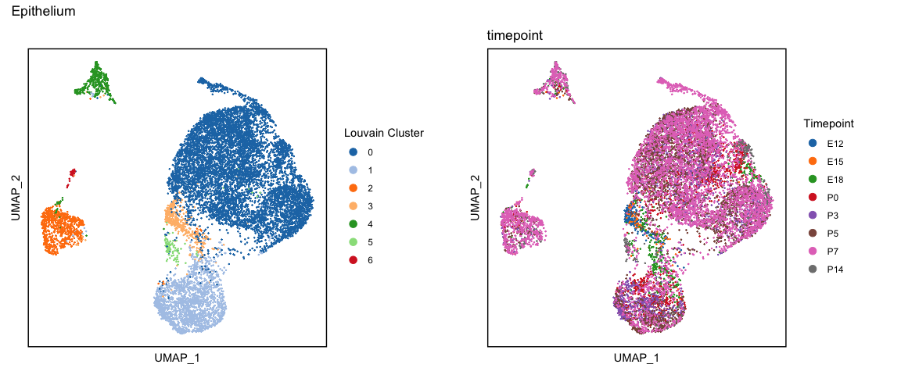
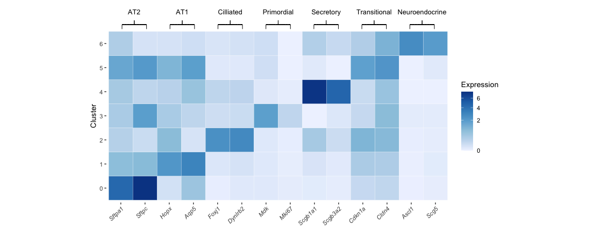
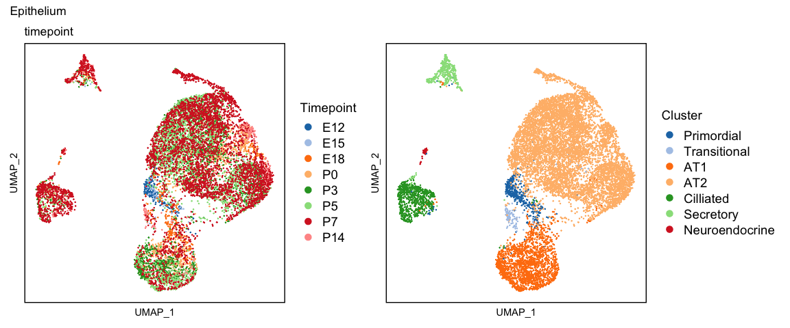
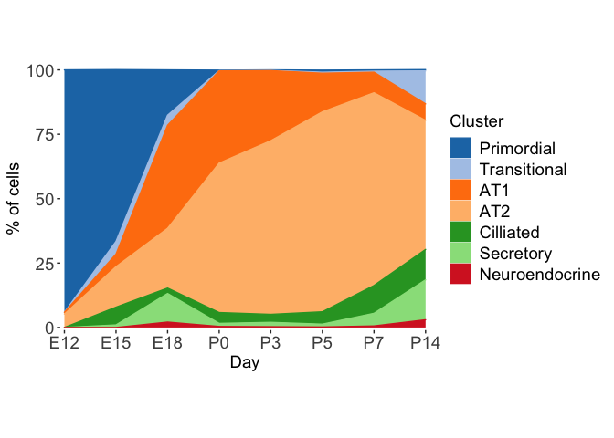
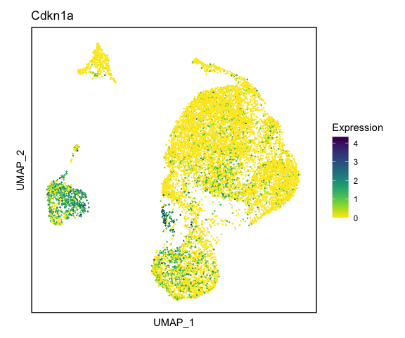
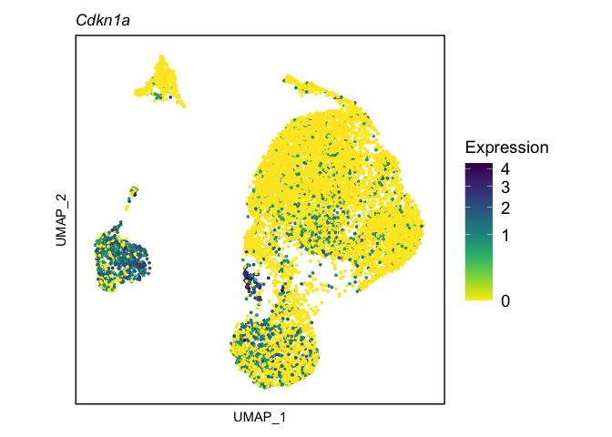
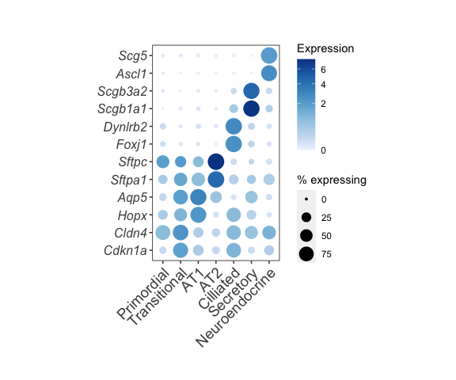

scSEQ analysis of the developing epithelium
================
Nick Negretti
11/17/20

# Analysis of the lung epithelium

## Load libraries and helper functions

``` r
setwd("~/postdoc/code/devo_scseq_github")
source("./helper_functions/globals.R")
source("./helper_functions/libraries.R")

opts_knit$set(root.dir = getwd())

source("./helper_functions/trajectory.R")
source("./helper_functions/cluster.R")
source("./helper_functions/colors.R")
source("./helper_functions/brackets.R")
source("./helper_functions/heatmaps.R")

plan("multiprocess", workers = N_WORKERS)
```

## Load data from merge and clean pipeline

``` r
epi <- readRDS("./data/epi_full_noGm42418_sct_p7b_integrated_retransform.rds")
epi
```

    ## An object of class Seurat 
    ## 42453 features across 11472 samples within 3 assays 
    ## Active assay: SCT (19466 features, 2000 variable features)
    ##  2 other assays present: RNA, integrated
    ##  2 dimensional reductions calculated: pca, umap

## UMAP and clustering

``` r
plan("sequential")

# Make the tiempoints an ordered factor, so they are displayed consistantly
epi$timepoint <- ordered(as.factor(epi$timepoint), unique(epi$timepoint))

epi <- cluster_pca_umap(epi, k_param = 5, dims_umap = c(1:5,7:19), dims_neighbors = c(1:5,7:30), cluster_res = 0.2) # Note, this breaks if future is set to plan: multiprocess
```

    ## Warning: The default method for RunUMAP has changed from calling Python UMAP via reticulate to the R-native UWOT using the cosine metric
    ## To use Python UMAP via reticulate, set umap.method to 'umap-learn' and metric to 'correlation'
    ## This message will be shown once per session

    ## Computing nearest neighbor graph

    ## Computing SNN

    ## Modularity Optimizer version 1.3.0 by Ludo Waltman and Nees Jan van Eck
    ## 
    ## Number of nodes: 11472
    ## Number of edges: 136857
    ## 
    ## Running Louvain algorithm...
    ## Maximum modularity in 10 random starts: 0.9195
    ## Number of communities: 12
    ## Elapsed time: 0 seconds

``` r
levels(Idents(epi)) <- c(0, 1, 0, 0, 2, 0, 3, 0, 4, 0, 5, 6)

p_cluster <- DimPlot(epi) + umap_theme() +
        scale_colour_manual(name = "Louvain Cluster", values = color_category_20) +
        theme(aspect.ratio=1)
p_time <- DimPlot(epi, group.by = "timepoint") + umap_theme() +
        scale_colour_manual(name = "Timepoint", values = color_scanpy_default)+
        theme(aspect.ratio=1)

p_cluster + p_time + plot_annotation("Epithelium")
```

<!-- -->

## Identify marker genes in each cluster

``` r
plan("multiprocess", workers = N_WORKERS)
filename <- "./data/epi_markers_clusters.rds"
if (!file.exists(filename)) {
  epi_markers <- parallelFindAllMarkers(epi)
  saveRDS(epi_markers, filename)
} else {
  epi_markers <- readRDS(filename)
}
```

### Cluster 0

``` r
epi_markers[[0 + 1]][n_print,]
```

    ##         p_val avg_logFC pct.1 pct.2 p_val_adj
    ## Lyz1        0  3.250316 0.427 0.120         0
    ## Lyz2        0  3.216945 0.872 0.327         0
    ## Sftpc       0  3.041989 0.996 0.263         0
    ## Sftpa1      0  3.000994 0.986 0.434         0
    ## Cxcl15      0  2.890386 0.993 0.460         0
    ## Sftpb       0  2.702440 0.996 0.473         0
    ## Lcn2        0  2.475672 0.836 0.167         0
    ## Slc34a2     0  2.403118 0.987 0.324         0
    ## Chil1       0  2.355068 0.949 0.313         0
    ## Napsa       0  2.193380 0.994 0.438         0
    ## Fabp5       0  2.057335 0.930 0.333         0
    ## Scd1        0  1.905539 0.791 0.104         0
    ## Dram1       0  1.822606 0.987 0.349         0
    ## Hc          0  1.819891 0.899 0.178         0
    ## Bex2        0  1.815027 0.923 0.261         0
    ## Lamp3       0  1.733716 0.905 0.172         0
    ## Lpcat1      0  1.695430 0.980 0.467         0
    ## S100g       0  1.671654 0.922 0.226         0
    ## Sftpd       0  1.668426 0.972 0.416         0
    ## Cd74        0  1.620670 0.942 0.465         0

### Cluster 1

``` r
epi_markers[[1 + 1]][n_print,]
```

    ##        p_val avg_logFC pct.1 pct.2 p_val_adj
    ## Sparc      0  3.181628 0.936 0.183         0
    ## Igfbp7     0  3.056584 0.944 0.178         0
    ## Ager       0  2.484885 0.990 0.816         0
    ## Aqp5       0  2.440046 0.952 0.380         0
    ## Fbln5      0  2.430716 0.894 0.027         0
    ## S100a6     0  2.373497 0.945 0.142         0
    ## Pmp22      0  2.362253 0.855 0.017         0
    ## Krt7       0  2.256702 0.959 0.384         0
    ## Ndnf       0  2.205774 0.883 0.128         0
    ## Hopx       0  2.165380 0.914 0.129         0
    ## Col4a4     0  2.158345 0.886 0.040         0
    ## Cav1       0  2.119861 0.811 0.013         0
    ## Emp2       0  2.093859 0.986 0.658         0
    ## Rtkn2      0  2.074782 0.861 0.025         0
    ## Akap5      0  2.036368 0.898 0.078         0
    ## Vegfa      0  2.022118 0.865 0.071         0
    ## Cyr61      0  2.015834 0.674 0.067         0
    ## Cryab      0  1.982688 0.884 0.056         0
    ## Tmsb10     0  1.965859 0.848 0.180         0
    ## Msln       0  1.954705 0.656 0.022         0

### Cluster 2

``` r
epi_markers[[2 + 1]][n_print,]
```

    ##          p_val avg_logFC pct.1 pct.2 p_val_adj
    ## AU040972     0  3.426545 0.868 0.005         0
    ## Dynlrb2      0  2.823391 0.983 0.023         0
    ## Sec14l3      0  2.756292 0.986 0.305         0
    ## Tmem212      0  2.711901 0.954 0.006         0
    ## Cyp2s1       0  2.661413 0.973 0.012         0
    ## Cd24a        0  2.592373 0.974 0.132         0
    ## Foxj1        0  2.556742 0.974 0.008         0
    ## Tppp3        0  2.552245 0.967 0.115         0
    ## Cdkn1c       0  2.499383 0.842 0.082         0
    ## Tubb4b       0  2.449934 0.991 0.576         0
    ## Ccdc153      0  2.358611 0.926 0.005         0
    ## Elof1        0  2.330024 0.973 0.146         0
    ## Tm4sf1       0  2.283112 0.946 0.009         0
    ## Pltp         0  2.215023 0.911 0.009         0
    ## Fam183b      0  2.187620 0.936 0.007         0
    ## Igfbp5       0  2.099285 0.916 0.034         0
    ## Csrp2        0  2.040499 0.906 0.034         0
    ## Gstm1        0  2.028499 0.915 0.059         0
    ## Ckb          0  2.005855 0.772 0.032         0
    ## Crip1        0  1.987270 0.864 0.222         0

### Cluster 3

``` r
epi_markers[[3 + 1]][n_print,]
```

    ##          p_val avg_logFC pct.1 pct.2 p_val_adj
    ## Mdk          0  2.295385 0.709 0.009         0
    ## Marcksl1     0  1.688158 0.786 0.116         0
    ## Gapdh        0  1.630559 0.989 0.835         0
    ## Hmgn2        0  1.620827 0.822 0.252         0
    ## Npm1         0  1.611866 0.953 0.574         0
    ## Eno1         0  1.598366 0.921 0.287         0
    ## Grb10        0  1.590160 0.743 0.046         0
    ## Mif          0  1.549496 0.896 0.468         0
    ## Ran          0  1.515853 0.837 0.307         0
    ## H19          0  1.459665 0.736 0.010         0
    ## Hnrnpa1      0  1.400490 0.889 0.463         0
    ## Cdk4         0  1.336834 0.847 0.342         0
    ## Ranbp1       0  1.327109 0.786 0.207         0
    ## Erh          0  1.280292 0.860 0.367         0
    ## Pkm          0  1.209198 0.953 0.616         0
    ## Prdx2        0  1.197844 0.928 0.493         0
    ## Hspd1        0  1.158524 0.810 0.322         0
    ## Prmt1        0  1.140408 0.795 0.232         0
    ## Snrpe        0  1.040305 0.878 0.431         0
    ## Snrpd1       0  1.006158 0.772 0.251         0

### Cluster 4

``` r
epi_markers[[4 + 1]][n_print,]
```

    ##                  p_val  avg_logFC pct.1 pct.2     p_val_adj
    ## Scgb1a1   0.000000e+00  6.8487983 0.959 0.017  0.000000e+00
    ## Scgb3a2   0.000000e+00  5.4543940 0.940 0.007  0.000000e+00
    ## Cyp2f2    0.000000e+00  3.3317094 0.971 0.092  0.000000e+00
    ## Hp        0.000000e+00  3.3016012 0.952 0.253  0.000000e+00
    ## Lypd2     0.000000e+00  2.2725654 0.844 0.042  0.000000e+00
    ## Cldn10    0.000000e+00  2.0640028 0.925 0.098  0.000000e+00
    ## Selenbp1  0.000000e+00  1.9552398 0.959 0.688  0.000000e+00
    ## Chad      0.000000e+00  1.6438372 0.651 0.002  0.000000e+00
    ## Gsta4     0.000000e+00  1.4634033 0.981 0.409  0.000000e+00
    ## Gsta3     0.000000e+00  1.4447108 0.849 0.023  0.000000e+00
    ## Mgst1     0.000000e+00  1.4241269 0.964 0.836  0.000000e+00
    ## Gstm2     0.000000e+00  1.3231980 0.834 0.084  0.000000e+00
    ## Lrrc26    0.000000e+00  1.2781855 0.800 0.004  0.000000e+00
    ## Gabrp     0.000000e+00  1.2652757 0.755 0.001  0.000000e+00
    ## Cckar     0.000000e+00  1.0800368 0.815 0.107  0.000000e+00
    ## Slc16a11  0.000000e+00  0.9851597 0.659 0.011  0.000000e+00
    ## Fam46c    0.000000e+00  0.8040509 0.603 0.005  0.000000e+00
    ## Cldn18    0.000000e+00 -2.3180303 0.113 0.927  0.000000e+00
    ## Fmo2     3.170419e-305  0.8217765 0.507 0.002 6.171537e-301
    ## Por      6.847002e-299  1.1483846 0.844 0.374 1.332837e-294

### Cluster 5

``` r
epi_markers[[5 + 1]][n_print,]
```

    ##                   p_val avg_logFC pct.1 pct.2     p_val_adj
    ## Cldn4     6.569330e-154 2.4180657 0.864 0.264 1.278786e-149
    ## Sfn       4.564384e-126 1.8143003 0.791 0.223 8.885030e-122
    ## Tnfrsf12a 6.372400e-122 1.5210067 0.836 0.138 1.240451e-117
    ## Cdkn1a    8.591964e-106 1.9868541 0.809 0.206 1.672512e-101
    ## Krt18     4.353680e-102 1.5255193 0.982 0.737  8.474873e-98
    ## Psmd8      3.496532e-87 1.0123261 0.818 0.495  6.806350e-83
    ## Clu        1.060732e-81 2.0481820 0.736 0.283  2.064821e-77
    ## Sqstm1     6.957972e-80 1.3443125 0.936 0.639  1.354439e-75
    ## Sprr1a     4.014304e-79 2.8291149 0.409 0.002  7.814244e-75
    ## Csrp1      9.043469e-79 1.4536594 0.855 0.277  1.760402e-74
    ## Phlda1     4.116982e-78 1.7869723 0.800 0.309  8.014118e-74
    ## Lgals3     5.213213e-78 1.9886997 0.855 0.231  1.014804e-73
    ## Krt8       7.001331e-75 1.3340814 0.964 0.617  1.362879e-70
    ## Eif2s2     5.896388e-67 1.0038881 0.755 0.407  1.147791e-62
    ## Myc        4.242730e-63 0.8918015 0.427 0.010  8.258898e-59
    ## Hspb8      1.603665e-62 1.0524253 0.745 0.191  3.121695e-58
    ## Nars       1.434303e-61 0.8987004 0.573 0.199  2.792015e-57
    ## Anxa1      1.940004e-59 1.7009127 0.936 0.406  3.776412e-55
    ## Ccng1      3.694253e-59 0.8787414 0.473 0.077  7.191234e-55
    ## Bax        8.112779e-56 0.8742785 0.582 0.234  1.579234e-51

### Cluster 6

``` r
epi_markers[[6 + 1]][n_print,]
```

    ##                 p_val avg_logFC pct.1 pct.2     p_val_adj
    ## Cd9     8.056110e-182  2.781099 1.000 0.763 1.568202e-177
    ## Scg5    1.654821e-159  2.126467 0.985 0.004 3.221274e-155
    ## Nnat    1.466733e-151  2.951630 0.969 0.252 2.855142e-147
    ## Espn    1.816258e-150  1.424011 0.815 0.069 3.535527e-146
    ## Ascl1   1.717538e-149  3.069604 0.908 0.000 3.343359e-145
    ## Resp18  1.034737e-148  3.059628 0.923 0.001 2.014218e-144
    ## Cplx2   3.895893e-147  2.138321 0.877 0.009 7.583745e-143
    ## Nov     9.348218e-141  2.546578 0.892 0.005 1.819724e-136
    ## Pcsk1   1.401140e-139  2.317615 0.877 0.000 2.727458e-135
    ## Chga    1.044052e-138  1.845234 0.877 0.000 2.032351e-134
    ## Chgb    7.135488e-137  1.694384 0.862 0.000 1.388994e-132
    ## Pcsk1n  1.894176e-135  2.058359 0.862 0.001 3.687203e-131
    ## Col8a1  5.338177e-133  2.206991 0.831 0.000 1.039130e-128
    ## Spock3  1.900957e-129  1.696241 0.846 0.001 3.700402e-125
    ## Tcerg1l 2.288463e-129  1.542115 0.815 0.000 4.454721e-125
    ## Lrp11   3.932923e-129  1.416437 0.923 0.007 7.655828e-125
    ## Calca   7.573797e-121  2.794352 0.785 0.001 1.474315e-116
    ## Tmem158 5.290229e-119  2.111851 0.831 0.021 1.029796e-114
    ## Meis2   5.421591e-116  1.743691 0.785 0.003 1.055367e-111
    ## Stmn3   2.655643e-115  1.480553 0.754 0.000 5.169475e-111

## Use known marker genes to determine the identity of the clusters

``` r
marker_genes <- c("Sftpa1", "Sftpc", # AT2
                  "Hopx", "Aqp5", #AT1
                  "Foxj1", "Dynlrb2", # Cilliated
                  "Mdk", "Mki67", # Primordial
                  "Scgb1a1", "Scgb3a2", # Secretory
                  "Cdkn1a", "Cldn4", # Transitional?
                  "Ascl1", "Scg5" #Neuroendocrine
                 )


heatmap_df <- make_heatmap_df(epi, marker_genes, sort_clusters = FALSE)

heatmap_df <- heatmap_df %>% group_by(gene,cluster) %>% summarise(expression_mean=mean(expression))
```

    ## `summarise()` regrouping output by 'gene' (override with `.groups` argument)

``` r
# For brackets and text (see ./helper_functions/brackets.R)
n_clusters <- max(as.numeric(Idents(epi)))
text_vec <- list(c("AT2", 2),
                 c("AT1", 2),
                 c("Cilliated", 2),
                 c("Primordial", 2),
                 c("Secretory", 2),
                 c("Transitional", 2),
                 c("Neuroendocrine", 2)
)

epi_heatmap <- ggplot(heatmap_df, aes(x = gene, y = cluster, fill = expression_mean)) +
  geom_tile(color = "white", size = 0.1) +
  scale_fill_distiller(palette = "Blues", direction = 1, trans = "sqrt", name = "Expression") +
  coord_fixed(ratio = 1, xlim = NULL, ylim = c(1,n_clusters), expand = TRUE, clip = "off") +
  theme(plot.margin=unit(c(1.5,1,1,1),"cm")) +
        addBrackets(text_vec) +
        addText(text_vec, n_clusters) +
  theme(panel.background = element_rect(fill = "white", colour = "black", size = 0),
        panel.grid.major = element_blank(),
        panel.grid.minor = element_blank(),
        axis.title.x  = element_blank()) +
  labs(y = "Cluster") +
  theme(axis.text.x = element_text(angle = 45, hjust=1, face = "italic"))

epi_heatmap
```

<!-- -->

``` r
saveTiff("./figures/epi/supp_cluster_markers.tiff", epi_heatmap,
         width = 10, height = 5)
```

    ## [1] TRUE

## Name cell types

Cells that are similar tend to cluster based on time, however we will
group them together because they are truly the same cell type.

``` r
epi_relabel <- epi
# Label the cell-types
levels(Idents(epi_relabel)) <- c("AT2", #0
                                 "AT1", #1
                                 "Cilliated", #2
                                 "Primordial", #3
                                 "Secretory", #4
                                 "Transitional", #5
                                 "Neuroendocrine" #6

)
Idents(epi_relabel) <- ordered(Idents(epi_relabel), c("Primordial", "Transitional", "AT1", "AT2", "Cilliated", "Secretory", "Neuroendocrine"))
epi_relabel$bulk_celltype <- "Epithelium"
#saveRDS(epi_relabel, "./data/epi_full_celltype_labels.rds")
```

# Relabel clusters based on marker gene expression

``` r
p_rename_cluster <- DimPlot(epi_relabel) + umap_theme() +
  scale_colour_manual(name = "Cluster", values = color_category_20) +
  theme(aspect.ratio=1) +
        theme(legend.text=element_text(size=14),
              legend.title=element_text(size=14))

p_time <- DimPlot(epi_relabel, group.by = "timepoint") + umap_theme() +
        scale_colour_manual(name = "Timepoint", values = color_category_20) +
        theme(aspect.ratio=1) +
        theme(legend.text=element_text(size=14),
              legend.title=element_text(size=14))

p_time + p_rename_cluster + plot_annotation("Epithelium")
```

<!-- -->

``` r
saveTiff("./figures/epi/epi_umap.tiff",
         p_rename_cluster + plot_annotation("Epithelium"),
         width = 6, height = 4.5)
```

    ## [1] TRUE

``` r
saveTiff("./figures/epi/supp_umap.tiff",
         p_cluster + p_time + p_rename_cluster + plot_annotation("Epithelium"),
         width = 18, height = 4.5)
```

    ## [1] TRUE

## Re-confirm the markers in the relabeled clusters

``` r
plan("multiprocess", workers = N_WORKERS)
filename <- "./data/epi_markers_clusters_relabeled.rds"
if (!file.exists(filename)) {
  epi_relabeled_markers <- parallelFindAllMarkers(epi_relabel)
  saveRDS(epi_relabeled_markers, filename)
} else {
  epi_relabeled_markers <- readRDS(filename)
}
```

### Primordial

``` r
epi_relabeled_markers[[0 + 1]][n_print,]
```

    ##          p_val avg_logFC pct.1 pct.2 p_val_adj
    ## Mdk          0  2.295385 0.709 0.009         0
    ## Marcksl1     0  1.688158 0.786 0.116         0
    ## Gapdh        0  1.630559 0.989 0.835         0
    ## Hmgn2        0  1.620827 0.822 0.252         0
    ## Npm1         0  1.611866 0.953 0.574         0
    ## Eno1         0  1.598366 0.921 0.287         0
    ## Grb10        0  1.590160 0.743 0.046         0
    ## Mif          0  1.549496 0.896 0.468         0
    ## Ran          0  1.515853 0.837 0.307         0
    ## H19          0  1.459665 0.736 0.010         0
    ## Hnrnpa1      0  1.400490 0.889 0.463         0
    ## Cdk4         0  1.336834 0.847 0.342         0
    ## Ranbp1       0  1.327109 0.786 0.207         0
    ## Erh          0  1.280292 0.860 0.367         0
    ## Pkm          0  1.209198 0.953 0.616         0
    ## Prdx2        0  1.197844 0.928 0.493         0
    ## Hspd1        0  1.158524 0.810 0.322         0
    ## Prmt1        0  1.140408 0.795 0.232         0
    ## Snrpe        0  1.040305 0.878 0.431         0
    ## Snrpd1       0  1.006158 0.772 0.251         0

### AT1

``` r
epi_relabeled_markers[[1 + 1]][n_print,]
```

    ##        p_val avg_logFC pct.1 pct.2 p_val_adj
    ## Sparc      0  3.181628 0.936 0.183         0
    ## Igfbp7     0  3.056584 0.944 0.178         0
    ## Ager       0  2.484885 0.990 0.816         0
    ## Aqp5       0  2.440046 0.952 0.380         0
    ## Fbln5      0  2.430716 0.894 0.027         0
    ## S100a6     0  2.373497 0.945 0.142         0
    ## Pmp22      0  2.362253 0.855 0.017         0
    ## Krt7       0  2.256702 0.959 0.384         0
    ## Ndnf       0  2.205774 0.883 0.128         0
    ## Hopx       0  2.165380 0.914 0.129         0
    ## Col4a4     0  2.158345 0.886 0.040         0
    ## Cav1       0  2.119861 0.811 0.013         0
    ## Emp2       0  2.093859 0.986 0.658         0
    ## Rtkn2      0  2.074782 0.861 0.025         0
    ## Akap5      0  2.036368 0.898 0.078         0
    ## Vegfa      0  2.022118 0.865 0.071         0
    ## Cyr61      0  2.015834 0.674 0.067         0
    ## Cryab      0  1.982688 0.884 0.056         0
    ## Tmsb10     0  1.965859 0.848 0.180         0
    ## Msln       0  1.954705 0.656 0.022         0

### AT2

``` r
epi_relabeled_markers[[2 + 1]][n_print,]
```

    ##         p_val avg_logFC pct.1 pct.2 p_val_adj
    ## Lyz1        0  3.250316 0.427 0.120         0
    ## Lyz2        0  3.216945 0.872 0.327         0
    ## Sftpc       0  3.041989 0.996 0.263         0
    ## Sftpa1      0  3.000994 0.986 0.434         0
    ## Cxcl15      0  2.890386 0.993 0.460         0
    ## Sftpb       0  2.702440 0.996 0.473         0
    ## Lcn2        0  2.475672 0.836 0.167         0
    ## Slc34a2     0  2.403118 0.987 0.324         0
    ## Chil1       0  2.355068 0.949 0.313         0
    ## Napsa       0  2.193380 0.994 0.438         0
    ## Fabp5       0  2.057335 0.930 0.333         0
    ## Scd1        0  1.905539 0.791 0.104         0
    ## Dram1       0  1.822606 0.987 0.349         0
    ## Hc          0  1.819891 0.899 0.178         0
    ## Bex2        0  1.815027 0.923 0.261         0
    ## Lamp3       0  1.733716 0.905 0.172         0
    ## Lpcat1      0  1.695430 0.980 0.467         0
    ## S100g       0  1.671654 0.922 0.226         0
    ## Sftpd       0  1.668426 0.972 0.416         0
    ## Cd74        0  1.620670 0.942 0.465         0

### Cilliated

``` r
epi_relabeled_markers[[3 + 1]][n_print,]
```

    ##          p_val avg_logFC pct.1 pct.2 p_val_adj
    ## AU040972     0  3.426545 0.868 0.005         0
    ## Dynlrb2      0  2.823391 0.983 0.023         0
    ## Sec14l3      0  2.756292 0.986 0.305         0
    ## Tmem212      0  2.711901 0.954 0.006         0
    ## Cyp2s1       0  2.661413 0.973 0.012         0
    ## Cd24a        0  2.592373 0.974 0.132         0
    ## Foxj1        0  2.556742 0.974 0.008         0
    ## Tppp3        0  2.552245 0.967 0.115         0
    ## Cdkn1c       0  2.499383 0.842 0.082         0
    ## Tubb4b       0  2.449934 0.991 0.576         0
    ## Ccdc153      0  2.358611 0.926 0.005         0
    ## Elof1        0  2.330024 0.973 0.146         0
    ## Tm4sf1       0  2.283112 0.946 0.009         0
    ## Pltp         0  2.215023 0.911 0.009         0
    ## Fam183b      0  2.187620 0.936 0.007         0
    ## Igfbp5       0  2.099285 0.916 0.034         0
    ## Csrp2        0  2.040499 0.906 0.034         0
    ## Gstm1        0  2.028499 0.915 0.059         0
    ## Ckb          0  2.005855 0.772 0.032         0
    ## Crip1        0  1.987270 0.864 0.222         0

### Secretory

``` r
epi_relabeled_markers[[4 + 1]][n_print,]
```

    ##                  p_val  avg_logFC pct.1 pct.2     p_val_adj
    ## Scgb1a1   0.000000e+00  6.8487983 0.959 0.017  0.000000e+00
    ## Scgb3a2   0.000000e+00  5.4543940 0.940 0.007  0.000000e+00
    ## Cyp2f2    0.000000e+00  3.3317094 0.971 0.092  0.000000e+00
    ## Hp        0.000000e+00  3.3016012 0.952 0.253  0.000000e+00
    ## Lypd2     0.000000e+00  2.2725654 0.844 0.042  0.000000e+00
    ## Cldn10    0.000000e+00  2.0640028 0.925 0.098  0.000000e+00
    ## Selenbp1  0.000000e+00  1.9552398 0.959 0.688  0.000000e+00
    ## Chad      0.000000e+00  1.6438372 0.651 0.002  0.000000e+00
    ## Gsta4     0.000000e+00  1.4634033 0.981 0.409  0.000000e+00
    ## Gsta3     0.000000e+00  1.4447108 0.849 0.023  0.000000e+00
    ## Mgst1     0.000000e+00  1.4241269 0.964 0.836  0.000000e+00
    ## Gstm2     0.000000e+00  1.3231980 0.834 0.084  0.000000e+00
    ## Lrrc26    0.000000e+00  1.2781855 0.800 0.004  0.000000e+00
    ## Gabrp     0.000000e+00  1.2652757 0.755 0.001  0.000000e+00
    ## Cckar     0.000000e+00  1.0800368 0.815 0.107  0.000000e+00
    ## Slc16a11  0.000000e+00  0.9851597 0.659 0.011  0.000000e+00
    ## Fam46c    0.000000e+00  0.8040509 0.603 0.005  0.000000e+00
    ## Cldn18    0.000000e+00 -2.3180303 0.113 0.927  0.000000e+00
    ## Fmo2     3.170419e-305  0.8217765 0.507 0.002 6.171537e-301
    ## Por      6.847002e-299  1.1483846 0.844 0.374 1.332837e-294

### Transitional

``` r
epi_relabeled_markers[[5 + 1]][n_print,]
```

    ##                   p_val avg_logFC pct.1 pct.2     p_val_adj
    ## Cldn4     6.569330e-154 2.4180657 0.864 0.264 1.278786e-149
    ## Sfn       4.564384e-126 1.8143003 0.791 0.223 8.885030e-122
    ## Tnfrsf12a 6.372400e-122 1.5210067 0.836 0.138 1.240451e-117
    ## Cdkn1a    8.591964e-106 1.9868541 0.809 0.206 1.672512e-101
    ## Krt18     4.353680e-102 1.5255193 0.982 0.737  8.474873e-98
    ## Psmd8      3.496532e-87 1.0123261 0.818 0.495  6.806350e-83
    ## Clu        1.060732e-81 2.0481820 0.736 0.283  2.064821e-77
    ## Sqstm1     6.957972e-80 1.3443125 0.936 0.639  1.354439e-75
    ## Sprr1a     4.014304e-79 2.8291149 0.409 0.002  7.814244e-75
    ## Csrp1      9.043469e-79 1.4536594 0.855 0.277  1.760402e-74
    ## Phlda1     4.116982e-78 1.7869723 0.800 0.309  8.014118e-74
    ## Lgals3     5.213213e-78 1.9886997 0.855 0.231  1.014804e-73
    ## Krt8       7.001331e-75 1.3340814 0.964 0.617  1.362879e-70
    ## Eif2s2     5.896388e-67 1.0038881 0.755 0.407  1.147791e-62
    ## Myc        4.242730e-63 0.8918015 0.427 0.010  8.258898e-59
    ## Hspb8      1.603665e-62 1.0524253 0.745 0.191  3.121695e-58
    ## Nars       1.434303e-61 0.8987004 0.573 0.199  2.792015e-57
    ## Anxa1      1.940004e-59 1.7009127 0.936 0.406  3.776412e-55
    ## Ccng1      3.694253e-59 0.8787414 0.473 0.077  7.191234e-55
    ## Bax        8.112779e-56 0.8742785 0.582 0.234  1.579234e-51

### Neuroendocrine

``` r
epi_relabeled_markers[[6 + 1]][n_print,]
```

    ##                 p_val avg_logFC pct.1 pct.2     p_val_adj
    ## Cd9     8.056110e-182  2.781099 1.000 0.763 1.568202e-177
    ## Scg5    1.654821e-159  2.126467 0.985 0.004 3.221274e-155
    ## Nnat    1.466733e-151  2.951630 0.969 0.252 2.855142e-147
    ## Espn    1.816258e-150  1.424011 0.815 0.069 3.535527e-146
    ## Ascl1   1.717538e-149  3.069604 0.908 0.000 3.343359e-145
    ## Resp18  1.034737e-148  3.059628 0.923 0.001 2.014218e-144
    ## Cplx2   3.895893e-147  2.138321 0.877 0.009 7.583745e-143
    ## Nov     9.348218e-141  2.546578 0.892 0.005 1.819724e-136
    ## Pcsk1   1.401140e-139  2.317615 0.877 0.000 2.727458e-135
    ## Chga    1.044052e-138  1.845234 0.877 0.000 2.032351e-134
    ## Chgb    7.135488e-137  1.694384 0.862 0.000 1.388994e-132
    ## Pcsk1n  1.894176e-135  2.058359 0.862 0.001 3.687203e-131
    ## Col8a1  5.338177e-133  2.206991 0.831 0.000 1.039130e-128
    ## Spock3  1.900957e-129  1.696241 0.846 0.001 3.700402e-125
    ## Tcerg1l 2.288463e-129  1.542115 0.815 0.000 4.454721e-125
    ## Lrp11   3.932923e-129  1.416437 0.923 0.007 7.655828e-125
    ## Calca   7.573797e-121  2.794352 0.785 0.001 1.474315e-116
    ## Tmem158 5.290229e-119  2.111851 0.831 0.021 1.029796e-114
    ## Meis2   5.421591e-116  1.743691 0.785 0.003 1.055367e-111
    ## Stmn3   2.655643e-115  1.480553 0.754 0.000 5.169475e-111

``` r
timepoint_factor <- factor(epi_relabel$timepoint)
timepoint_ordered <- ordered(timepoint_factor, levels = unique(epi_relabel$timepoint))

cell_ident_df <- data.frame(timepoint = timepoint_ordered,
                            cluster = Idents(epi_relabel))

prop_celltypes <- round(prop.table(table(cell_ident_df$timepoint, cell_ident_df$cluster), 1) * 100, 1)


epi_mountain <- ggplot(melt(prop_celltypes) %>% arrange(Var2), aes(y=value, x=Var1)) +
        geom_area(aes(color = as.factor(Var2), group=as.factor(Var2), fill = as.factor(Var2))) +
        xlab("Day") +
        ylab("% of cells") +
        labs(fill = "Cluster", color = "Cluster", group = "Cluster") +
        scale_colour_manual(aesthetics = c("color", "fill"), values=color_category_20) +
        theme(legend.key=element_blank(),
              legend.text=element_text(size=14),
              legend.title=element_text(size=14),
              axis.text.x  = element_text(size=14),
              axis.text.y = element_text(size=14),
              axis.title.x = element_text(size=14),
              axis.title.y = element_text(size=14),
              panel.grid.major = element_blank(),
              panel.grid.minor = element_blank(),
              panel.background = element_rect(fill = "white")
        ) +
        scale_x_discrete(expand = c(.01, .01)) +
        scale_y_continuous(expand = c(.01,.01)) +
        coord_fixed(0.05)

epi_mountain
```

<!-- -->

``` r
saveTiff("./figures/epi/labeled_mountain.tiff",
         epi_mountain,
         width = 7, height = 4)
```

    ## [1] TRUE

## Cdkn1a expression across the epithelium

``` r
FeaturePlot(epi, "Cdkn1a") +
  featureplot_theme() +
  theme(aspect.ratio=1) +
  scale_color_viridis(name = "Expression", direction = -1)
```

    ## Scale for 'colour' is already present. Adding another scale for 'colour',
    ## which will replace the existing scale.

<!-- -->

# Where is Cdkn1a expressed

``` r
cdkn1a_epi_plot <- FeaturePlot(epi, "Cdkn1a", pt.size = 0.6) +
        featureplot_theme() +
        theme(aspect.ratio=1) +
        scale_color_viridis(name = "Expression", direction = -1, trans = "sqrt") +
        theme(legend.text=element_text(size=14),
              legend.title=element_text(size=14),
              legend.key.size = unit(0.8, "cm"),
        plot.title = element_text(face = "italic"))
```

    ## Scale for 'colour' is already present. Adding another scale for 'colour',
    ## which will replace the existing scale.

``` r
cdkn1a_epi_plot
```

<!-- -->

``` r
saveTiff("./figures/epi/epi_cdkn1a.tiff",
         cdkn1a_epi_plot,
         width = 6, height = 4.5)
```

    ## [1] TRUE

## Transitional cluster expression patterns

``` r
markers <- factor(c("Cdkn1a", "Cldn4", # Transitional?
                    "Hopx", "Aqp5", #AT1
                    "Sftpa1", "Sftpc", # AT2
                    "Foxj1", "Dynlrb2", # Cilliated
                    "Scgb1a1", "Scgb3a2", # Secretory
                    "Ascl1", "Scg5" # Neuroendocrine
                 ), ordered = TRUE
)


heatmap_df <- make_heatmap_df(epi_relabel, markers, sort_clusters = FALSE)

heatmap_df <- heatmap_df %>% group_by(cluster,gene) %>% summarise(expression_mean=mean(expression),
                                                                  frac_pos=(sum(expression > 0) * 100 / length(expression)))
```

    ## `summarise()` regrouping output by 'cluster' (override with `.groups` argument)

``` r
heatmap_df <- heatmap_df %>% mutate(gene = factor(gene, markers))


transitional_heatmap <- ggplot(heatmap_df, aes(x = cluster, y = gene, color = expression_mean, size = frac_pos)) +
        geom_point(shape = 16) +
        scale_size(range = c(1, 7), name = "% expressing") +
        scale_color_distiller(palette = "Blues", direction = 1, trans = "sqrt", name = "Expression") +
        coord_fixed(ratio = 1) +
        theme(plot.margin=unit(c(1.5,1,1,1),"cm")) +
        theme(panel.background = element_rect(fill = "white", color = "black", size = 0.5),
              panel.grid.major = element_blank(),
              panel.grid.minor = element_blank(),
              axis.title.x  = element_blank(),) +
        labs(y = "") +
        theme(axis.text.x  = element_text(size=14, angle = 45, vjust = 1, hjust=1),
              #axis.ticks.x = element_blank(),
              axis.text.y = element_text(size = 12, face = "italic"))


transitional_heatmap
```

<!-- -->

``` r
saveTiff("./figures/epi/transitional_cluster_expression.tiff",
         transitional_heatmap,
         width = 4.5, height = 5.5)
```

    ## [1] TRUE
